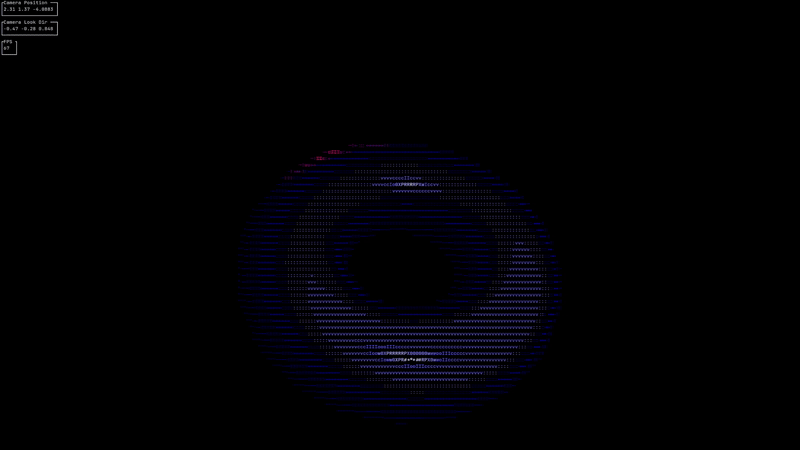

# CLI raytracer
A simple ray tracer written in C++ that renders 3D scenes directly to the terminal using ASCII art. This interactive tool supports lighting, shadows, and multiple geometric primitives, all displayed in the terminal with customizable scenes and outputs.

## Features
- **Real-time ASCII rendering** in terminal with interactive camera controls
- **Multiple geometry types**: Spheres, planes, and OBJ file mesh support
- **Advanced acceleration**: Bounding Volume Hierarchies for optimized rendering
- **Lighting models**: Basic Phong and flat shading with shadows
- **Custom scene building** through text-based scene files
- **Multiple output formats**: Terminal display, PNG images, and frame sequences

## Usage
### Command Line Options

| Flag | Parameters | Description |
|------|------------|-------------|
| `-i` | `<input_scene>` | Input scene file |
| `-s` | `<scene_number>` | Test scene file number (uses built-in scenes: `source/scenes/ts_<number>.txt`) |
| `-d` | `<width> <height> <debug_x> <debug_y>` | Debug mode - outputs debug info for pixel (`debug_x`, `debug_y`) at specified resolution, writes to debug.png |
| `-o` | `<output_file> <scale>` | Output the first frame to `output_file` at resolution term-width × term-height scaled by `scale` |
| `-O` | `<output_dir> <frame_i> <scale> <max_frames>` | Output every ith frame to `output_dir` scaled by `scale` until `max_frames` is reached |
| `-t` | `<output_dir> <frame_i> <max_frames>` | Output every ith frame to `output_dir` until `max_frames` is reached |

### print_ascii.py
This simple script prints the contents of a directory of ascii frames to the terminal in a loop.

`print_ascii.py <directory>`

### Controls
- `W`, `A`, `S`, `D`: Move camera forward, left, backward, right
- `Q`: Quit
- `R`: Toggle rotate mode, using WASD to rotate the camera around the selected object

## Notes
The "pixels" in the terminal are not perfectly square, so the image may appear stretched if the aspect ratio is not correct for your terminal. I guessed the aspect ratio based on my terminal settings. Change the `PIXEL_AR` variable in `config.h` to adjust.

