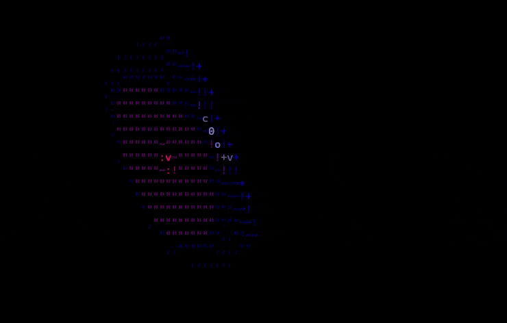

# CLI raytracer
This is a simple raytracer written in C++ that renders scenes directly to the terminal as ASCII art. The program calculates lighting and shadows to create 3D-looking images using only text.

## Features
Real-time ASCII rendering in terminal

Spheres, planes, and obj files for meshes

Bounding Volume Hierarchies

Basic phong and flat shaders

Custom scene building

## Usage
-i input_scene: file where the scene is located

-d width height debug_x debug_y: render once to debug.png with debug pixel coordinates

-o output_file: render the first frame at higher resolution than the terminal to an output png

-O dump_file: render every 10th frame to a file with dump_file_frame.png

